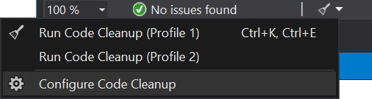
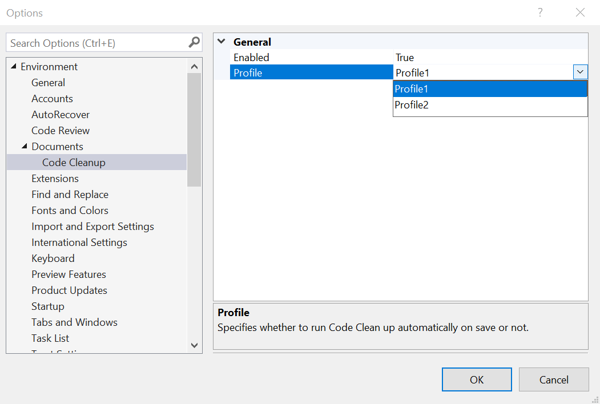

# Code Cleanup On Save

Download the extension at the
[Visual Studio Marketplace](https://marketplace.visualstudio.com/items?itemName=MadsKristensen.CodeCleanupOnSave)
or try the
[CI build](http://vsixgallery.com/extension/66985471-b701-4851-a2d7-5a8bdce1e694/).

---------------------------------------

Automatically run one of the Code Clean profiles when saving the document. This ensures your code is always formatted correctly and follows your coding style conventions.

### Configure Code Cleanup profiles

At the bottom of the C# editor, click the Configure Code Cleanup. 

By default, **Profile 1** is executed on save by this extenions.

### Options
The options page allows you to chose between which profile to run automatically on save.

## License
[Apache 2.0](LICENSE)